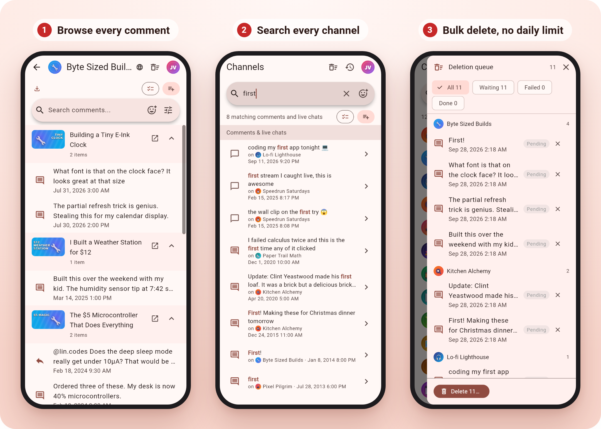
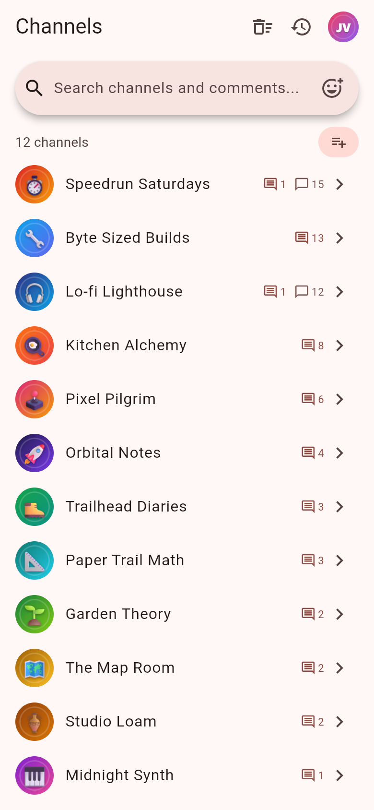
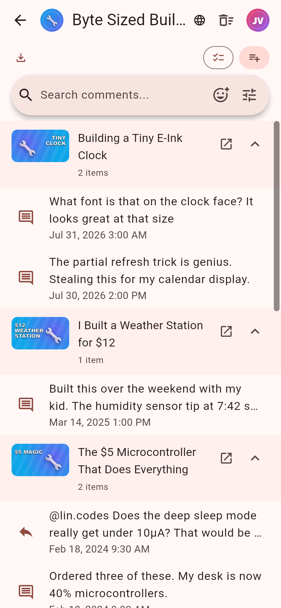
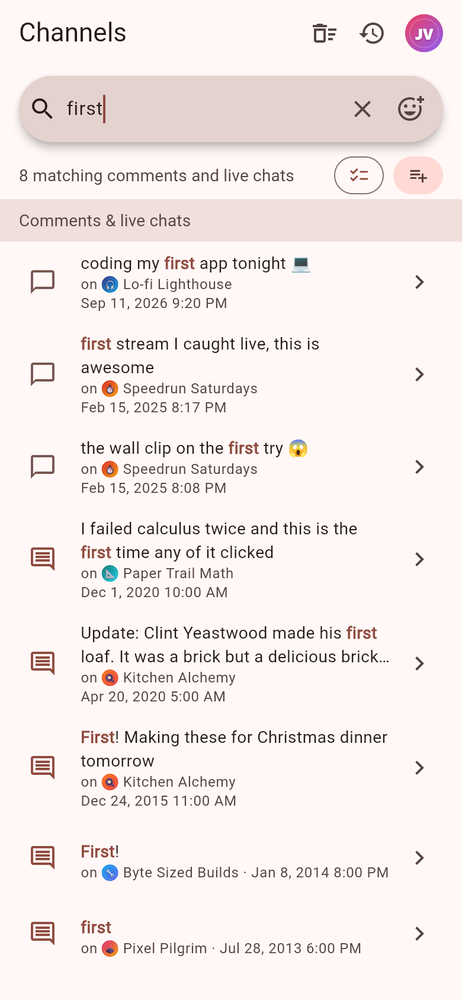
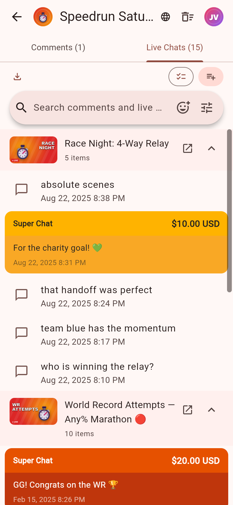
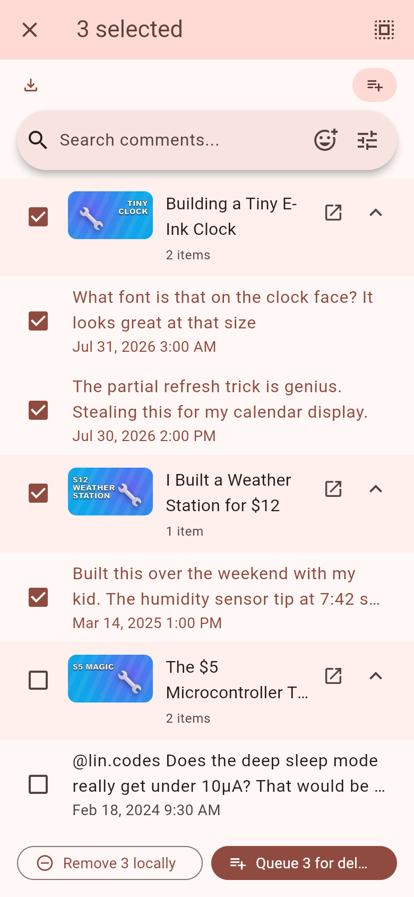
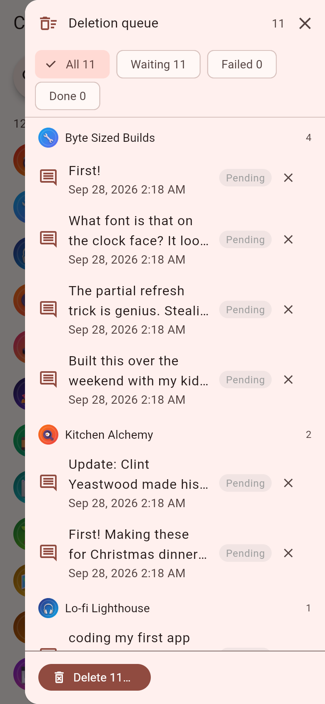
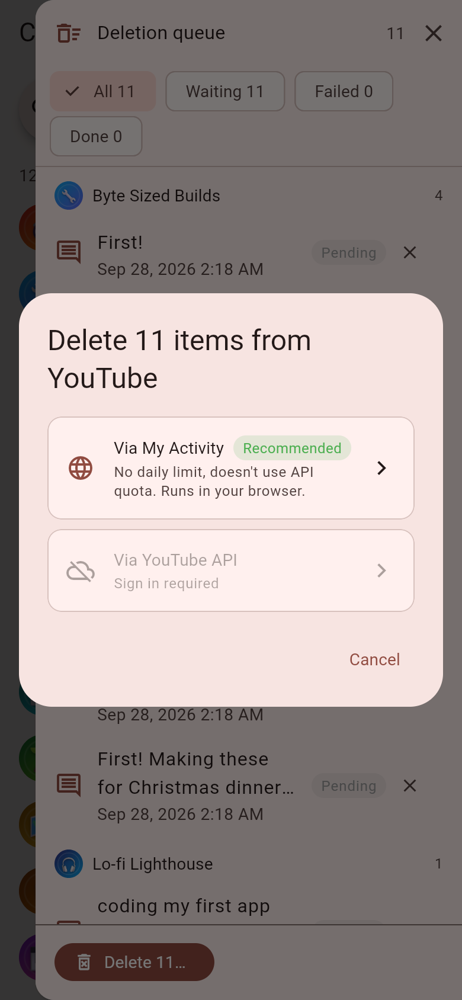
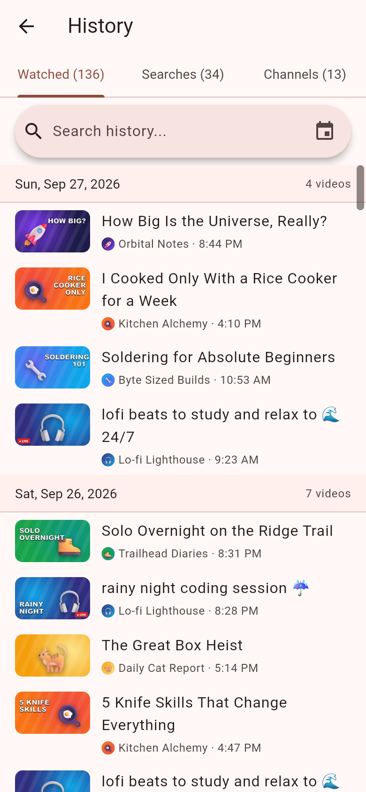
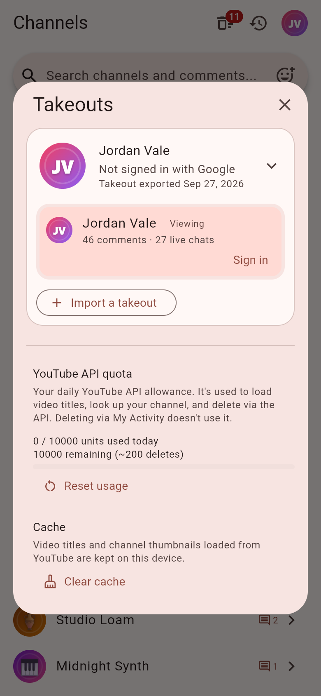

<h1 align="center">Takeout Manager for YouTube</h1>

<p align="center">
  <b>Find, search, and bulk-delete every YouTube comment and live chat you've ever posted, from your Google Takeout.</b>
</p>

<p align="center">
  
  
  
  
</p>

<p align="center">
  <picture>
    <source media="(prefers-color-scheme: dark)" srcset="docs/screenshots/hero-dark.png">
    
  </picture>
</p>

<details>
<summary><b>More screenshots</b></summary>
<br>
<table>
  <tr>
    <td align="center"><br><sub>Every channel you commented on</sub></td>
    <td align="center"><br><sub>Comments grouped by video</sub></td>
    <td align="center"><br><sub>Search every channel at once</sub></td>
  </tr>
  <tr>
    <td align="center"><br><sub>Live chats and Super Chats</sub></td>
    <td align="center"><br><sub>Select what to delete</sub></td>
    <td align="center"><br><sub>One queue for everything</sub></td>
  </tr>
  <tr>
    <td align="center"><br><sub>Delete without API limits</sub></td>
    <td align="center"><br><sub>Watch and search history</sub></td>
    <td align="center"><br><sub>Your takeout and API quota</sub></td>
  </tr>
</table>
</details>

```sh
git clone https://github.com/getBoolean/youtube_takeout_manager.git
cd youtube_takeout_manager
cp .env.example .env
flutter run -d windows --dart-define-from-file=.env   # or macos, linux, chrome
```

## TL;DR

**Problem:** YouTube keeps every comment you've posted, scattered across the videos you posted them on. You can't search them, and you can't delete them by channel, by video, or by what they say. Google Takeout will give you a copy, but it's a pile of CSV files with video IDs instead of titles and no way to act on any of it.

**Solution:** Takeout Manager opens that export and lays out every comment and live chat by channel and video. Search all of them at once, pick what should go, and delete it — through YouTube's API, or with a script on Google's My Activity page that has no daily limit.

| You want to… | Takeout Manager |
| --- | --- |
| Find one comment from years ago | Searches every comment, live chat, and video title at once, ignoring case and accents |
| Clear out everything you said on one channel | Select all on that channel, add to the queue, delete |
| Delete thousands in one sitting | Script deletion: about one per second, no API quota |
| Delete steadily without babysitting it | API deletion: live queue with pause/resume and a quota meter |
| Keep a copy before deleting | Export to CSV or JSON |
| Look back at what you watched | Watch and search history, day by day |

**How it works:**

1. **Export** your YouTube data from [Google Takeout](https://takeout.google.com/) ([steps below](#get-your-youtube-takeout)).
2. **Import** the zip. It's read and saved on your device; nothing is uploaded.
3. **Browse, search, select, delete.**

## Quick Start

You need the [Flutter SDK](https://docs.flutter.dev/get-started/install). No Google Cloud setup is needed to start: without it you can browse, search, export, and delete with the script. [Sign-in](#set-up-google-sign-in-optional) adds API deletion and video titles whenever you want them.

```sh
# 1. Get the code
git clone https://github.com/getBoolean/youtube_takeout_manager.git
cd youtube_takeout_manager

# 2. Create an empty config (sign-in stays off until you fill it in)
cp .env.example .env

# 3. Run it
flutter run -d windows --dart-define-from-file=.env
```

Replace `windows` with `macos`, `linux`, or `chrome`. For phones and release builds, see [Run on any platform](#run-on-any-platform).

### Get your YouTube Takeout

1. Open [takeout.google.com](https://takeout.google.com/) and click **Deselect all**.
2. Scroll to **YouTube and YouTube Music** and tick it.
3. Click **All YouTube data included** and untick **videos**. That option is your uploaded video files and can make the export enormous. Keep **comments**, **live chats**, **history**, **channel**, and **subscriptions**; [the table below](#whats-in-a-youtube-takeout) shows what the app does with each.
4. Click **Next step**, choose **Export once**, then **Create export**. It can take hours or days; Google emails you when it's ready.
5. Download the zip and import it in the app.

History can be HTML or JSON; both import. Large exports are split into several zips. Import them together, or one at a time: any part with something the app reads imports on its own.

### What's in a YouTube Takeout

Everything sits under `Takeout/YouTube and YouTube Music/` in the zip. Anything the app doesn't read is skipped, so there's no harm in leaving it ticked.

| Folder | What it holds | Supported | What the app does with it |
| --- | --- | --- | --- |
| `comments` | Every comment you've posted (`comments.csv`, split into numbered files) | Yes | Browse, search, delete, export |
| `live chats` | Every live chat message and Super Chat (`live chats.csv`, numbered the same way) | Yes | Browse, search, delete, export |
| `history` | `watch-history` and `search-history`, as HTML or JSON | Read-only | Browse and search day by day; YouTube's API can't delete history |
| `channels` | `channel.csv` and `channel URL configs.csv` | Yes | Names your account's channels and their handles |
| `channels` | Community moderation settings, feature data, images, page settings | No | |
| `subscriptions` | `subscriptions.csv` | Partly | Names the channels you commented on; no subscriptions list |
| `playlists` | `playlists.csv`, plus one `…-videos.csv` per playlist | No | |
| `video metadata` | Details of your uploads: `videos.csv`, `video texts.csv`, `video recordings.csv` | No | |
| `videos` | Your uploaded video files | No | Untick it; it only makes the export bigger |
| `clips` | `clips.csv` | No | |
| `music (library and uploads)` | `music library songs.csv` and any music you uploaded | No | |
| `playables` | Save data for YouTube Playables games | No | |

## Features

- **Everything in one place.** Every comment and live chat you've posted, grouped by channel and video.
- **Search it all.** Comment text, video titles, and emoji, ignoring case and accents.
- **Bulk delete.** Select a whole channel at once and delete through YouTube's API or a quota-free script, from [one queue](#deleting-two-ways-one-queue) that survives restarts.
- **Merge takeouts.** Import newer exports on top of older ones; anything since gone from YouTube is kept and marked.
- **Watch and search history.** Browse and search it day by day.
- **Export.** Save comments and live chats as CSV or JSON.

## Deleting: two ways, one queue

| | YouTube API | My Activity script |
| --- | --- | --- |
| **Speed** | About 200 a day (each delete costs 50 of the 10,000 daily quota units) | About one per second, no quota |
| **Needs** | [Sign-in](#set-up-google-sign-in-optional) with your own Google Cloud client | A browser signed in to the same Google account |
| **Runs** | Inside the app, with pause and resume | In a My Activity tab you keep open |
| **Results** | Tracked live in the queue | The script copies a report; paste it back into the app |
| **Best for** | Steady, hands-off cleanup | One big cleanup |

Mix them freely. Queue everything, send some through the API, and hand the rest to the script.

The script path takes four steps, and the app walks you through each one: open [My Activity's YouTube comments page](https://myactivity.google.com/page?hl=en&page=youtube_comments), copy the generated script, paste it into the browser console, and paste its results back in. The script's source is [assets/scripts/delete_comments.js](assets/scripts/delete_comments.js); read it before you run it.

## Your data stays on your device

- Your takeout is read and saved locally: in the app's data folder on desktop and mobile, in browser storage on web. There's no server behind this app.
- No analytics or telemetry.
- The app only goes online for what you ask of YouTube: sign-in, deletions, and — once you've signed in — video titles, thumbnails, and channel pictures. It also reads YouTube's public live chat replays to name custom emoji the takeout leaves unnamed (desktop and mobile only).
- Sign-in tokens are kept in the OS's secure storage.
- Quota use is counted as it happens, so you always see what's left today.

## Why not just use…?

| | YouTube's comment history | The raw Takeout files | Takeout Manager |
| --- | --- | --- | --- |
| Every comment and live chat in one place | Yes | Yes, as CSV rows | Yes, by channel and video |
| Delete by channel, video, or search match | No | No | Yes |
| Video titles beside your comments | Yes | No, video IDs only | Yes, once signed in |
| Works after your channel is deleted | No | Yes | Yes |
| Remembers what's since been deleted | No | Only in old exports | Yes, merged and marked |

**Use YouTube's comment history** to delete a handful of recent comments.
**Use Takeout Manager** to find specific comments among thousands, or to clean up in bulk.

## Limitations

| Limitation | Workaround |
| --- | --- |
| No prebuilt downloads yet | [Quick Start](#quick-start) builds and runs it with one command |
| API deletion tops out around 200 a day | Use the script path |
| The script relies on My Activity's internals; a Google change can break it | The API path still works; [open an issue](https://github.com/getBoolean/youtube_takeout_manager/issues) |
| Sign-in needs your own Google Cloud OAuth client | Everything but API deletion and video titles works without it |
| Video titles, thumbnails, and channel pictures need sign-in | Every comment still links to its video |
| Watch and search history is read-only | Delete it on [My Activity](https://myactivity.google.com/) |
| Custom emoji names aren't looked up on web (browser CORS rules) | Use a desktop or mobile build |
| Deleting from YouTube is permanent | Export first; use **Remove** to hide items without deleting them |

## FAQ

<details>
<summary><b>Is it safe to paste a script into the browser console?</b></summary>

Only paste code you've read. This one is generated from [assets/scripts/delete_comments.js](assets/scripts/delete_comments.js) with the IDs you selected filled in. It calls My Activity's own delete action for those IDs, one per second, and copies a results report to your clipboard. It sends nothing anywhere else.

</details>

<details>
<summary><b>Does it work if I'm signed out, or my channel is deleted?</b></summary>

Yes. Browsing, searching, history, and export all run from the takeout alone. Only deletion needs a live account.

</details>

<details>
<summary><b>Can I undo a deletion?</b></summary>

No. YouTube doesn't restore deleted comments. Export what you want to keep first.

</details>

<details>
<summary><b>Why do I only see video IDs, not titles?</b></summary>

Takeout's comment files don't include titles. Sign in and the app fetches them, 50 videos per quota unit, and keeps them on your device.

</details>

<details>
<summary><b>My Google account has several channels. Which one do I see?</b></summary>

One at a time. A takeout covers the whole Google account, so it can include several channels. Pick one to view, and sign in as that channel to delete its comments.

</details>

## Run on any platform

Every command takes `--dart-define-from-file=.env` (shortened to `…` below). Run `flutter devices` to see what's connected, and `flutter doctor` to check the toolchain for a platform.

| Platform | Run | Release build | Toolchain |
| --- | --- | --- | --- |
| Windows | `flutter run -d windows …` | `flutter build windows …` | Visual Studio 2026, "Desktop development with C++" |
| macOS | `flutter run -d macos …` | `flutter build macos …` | Xcode + command-line tools |
| Linux | `flutter run -d linux …` | `flutter build linux …` | `clang cmake ninja-build pkg-config libgtk-3-dev liblzma-dev` |
| Web | `flutter run -d chrome --web-port=9000 …` | `flutter build web …` | Chrome |
| Android | `flutter run -d <device> …` | `flutter build apk …` | Android Studio + SDK |
| iOS | `flutter run -d <device> …` | `flutter build ipa …` | Xcode |

On web, keep `--web-port` equal to the port you registered for sign-in. The VS Code launch configs in [.vscode/launch.json](.vscode/launch.json) pass `.env` for you. Sign-in tokens use [flutter_secure_storage](https://github.com/juliansteenbakker/flutter_secure_storage), which needs [extra setup](https://github.com/juliansteenbakker/flutter_secure_storage/blob/develop/README.md) on some platforms.

## Set up Google sign-in (optional)

Sign-in turns on API deletion, video titles, thumbnails, and channel pictures. It needs a Google Cloud OAuth client, which is free.

<details>
<summary><b>Step-by-step Google Cloud setup</b></summary>

1. Open the [Google Cloud Console](https://console.cloud.google.com/) and create or select a project.
2. **Enable the YouTube Data API v3:** go to **APIs & Services > Library**, search for "YouTube Data API v3", and click **Enable**.
3. **Configure Google Auth Platform** (in the sidebar):
   - **Branding** — set an app name and support email.
   - **Audience** — choose **External** and add your Google account as a test user. Without this, sign-in fails with 403 while the app is in "Testing".
   - **Data Access** — add the scopes `openid`, `email`, `profile`, and `https://www.googleapis.com/auth/youtube.force-ssl`.
4. **Create OAuth clients** under **Clients**:
   - **Desktop app** — copy the **Client ID** and **Client Secret**.
   - **Web application** — add your run URL (e.g. `http://localhost:9000`) to **Authorized JavaScript origins** and copy the **Client ID**. No secret is needed.
5. Fill in `.env` in the project root (it's gitignored):

   ```properties
   GOOGLE_CLIENT_ID=your-desktop-client-id
   GOOGLE_CLIENT_SECRET=your-desktop-client-secret
   GOOGLE_WEB_CLIENT_ID=your-web-client-id
   ```

6. Restart the app.

</details>

## Troubleshooting

**`--dart-define-from-file` can't find `.env`**
Create it: `cp .env.example .env`.

**"Access blocked" or 403 on sign-in**
Your Google account isn't a test user. Add it under **Google Auth Platform > Audience**.

**Web sign-in redirect fails**
The port in your URL must match **Authorized JavaScript origins** exactly.

**The script stops with "Could not find XSRF token" or "Could not discover delete rpcid"**
Run it on [My Activity's YouTube comments page](https://myactivity.google.com/page?hl=en&page=youtube_comments), signed in, after the page has finished loading. If it still fails, Google may have changed the page; [open an issue](https://github.com/getBoolean/youtube_takeout_manager/issues).

**API deletion stopped with the quota used up**
YouTube's quota resets at midnight Pacific time. Switch to the script to keep going today.

**`flutter doctor` flags a platform**
Fix that platform's toolchain before running on it.

## Development

Requires Dart 3.11 or newer (any current stable Flutter). Generated files (`*.g.dart`, `*.mapper.dart`, `*.gr.dart`) are checked in. After editing annotated sources, regenerate them:

```sh
dart run build_runner build --delete-conflicting-outputs   # once
dart run build_runner watch --delete-conflicting-outputs   # while you work
```

Tests:

```sh
flutter test                        # everything that runs on the Dart VM
dart test -p chrome test_browser    # web storage (IndexedDB), in Chrome
```

The web storage tests use `dart test`, not `flutter test --platform chrome`: the Flutter browser test host crashes before running any test (its page lacks the `#play` element the `test` runner expects).

## License

[MIT](LICENSE)
